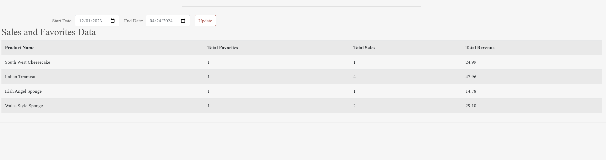

#BoboShop
<h1 align="center">BoboShop</h1>

[View the live project here](https://boboshop-4896cb751ade.herokuapp.com/)

At BoboShop, we take pride in using only the finest, high-quality ingredients to craft our cakes. Each cake is made from scratch by our team of skilled pastry chefs, who meticulously blend together premium butter, fresh eggs, sweet vanilla, and other carefully selected components. Whether you're in the mood for a rich, decadent chocolate cake or a light and airy lemon chiffon, we have a wide selection of flavors to satisfy every palate.

Beyond classic flavors, we also offer innovative and unique cake designs to make your special occasions even more memorable. From elegant tiered wedding cakes to whimsical birthday cakes adorned with edible flowers, our cakes are not only delicious, but true works of art. We work closely with each customer to customize the cake of their dreams, ensuring that every detail is perfect.


## Index – Table of Contents
- [Index – Table of Contents](#index--table-of-contents)
- [User Experience (UX)](#user-experience-ux)
- [Features](#features)
- [Design](#design)
- [Technologies Used](#technologies-used)
- [Testing](#testing)
- [Deployment](#deployment)
- [Credits](#credits)
- [Bugs](#bugs)
- [Acknowledgements](#acknowledgements)


## User Experience (UX)

- ### User stories
  - #### A. First Time Visitor
    1. As a first time visitor, I want to see the most rated cakes.
    3. As a first time visitor, I want to purchase without creating an account.
    4. As a first time visitor, I want an easy and secure checkout process.
    4. As a first time visitor, I want an order confirmation.

  - #### B. Returning Visitor
    1. As a first time visitor, I want to be able to register on website.
    2. As a returning visitor, I want to be able to log in to the website.
    3. As a returning visitor, I want to be able to favourite cakes.
    4. As a returning visitor, I want to be able to change my password.
    5. As a returning visitor, I want to be able to add, edit or delete reviews for cakes.
  - #### C. Administrator
    1. As an administrator, I want to be able to add cakes.
    2. As an administrator, I want to be able to edit cakes.
    2. As an administrator, I want to be able to delete the cakes.
    2. As an administrator, I want to be able to track the cakes stats.
    2. As an administrator, I want to be able to track sales.


## Features
 - ### NavBar
    This navigation bar provides a user-friendly interface for navigating through various product categories on a website. It includes dropdown menus for easy access to different types of cakes, including layer cakes, sponge cakes, and cheesecakes. Users can easly access their account and see the total price of the bag content. The navigation bar is responsive, ensuring accessibility across different devices.
    
- ### Index Page
   Index page consist of a background image with a welcome message and a button to redirect users to the cake list.
    

- ### Free Delivery banner
    Right under the navbar, there is a section where visitors are informed about the delivery threshold.
    
- ### Toast Messages
    Toast messages are displayed for many different event types, including Success, Error, Info, and Warning. They serve as concise notifications that inform users about various outcomes, such as successful completion of tasks or encountering errors. Toast messages offer great functionality in enhancing user experience by promptly delivering relevant information in a non-intrusive manner. For instance, toast messages are very useful for following the shopping bag while users are adding products, ensuring they stay informed about their shopping progress.
    
- ### Sign In and Sign Up 
    Sign in and Sign up functionalities are essential components of our cake website, providing users with personalized access to a range of features and services. Existing users can easily access their accounts by signing in, this process  grants them access to their saved preferences, order history and profile.
    

    

- ### User Profile
  Enables users to access and modify their default delivery details. Also shows a list of orders placed by the user.
    

- ### Products view
  This page is displaying products in a grid layout tailored to the user's device. It serves as a hub for displaying all products, along with options for filtering by category and search parameters. Additionally, users can access their favorite products through the "My Account" menu. Results on this page can be sorted using various criteria available in the "sort by" menu. Each product is tagged with ratings, categories and whether it's on whishlist for another user. For superusers, there's the added feature of displaying the total number of favorites a product has, along with links for editing and deleting products. Lastly, a "back to top" button is conveniently included below.
  

- ### Product detail
  This page offers users a detailed product description along with the information tags featured on the product page. Here, users can conveniently add or remove the product from their favorites. Additionally, there's a quantity selector input allowing users to add the item to their bag or return to the products view. For superusers, the page also showcases the total number of favorites the product has gain from users, along with links for editing and deleting the product.
  

- ### Review Section
  The website's review section provides users with a way to share their experiences, opinions, and ratings. It enables users to leave feedback on products, services, or any aspect of our platform. With this feature, users can make informed decisions based on real user experiences and insights.
  

- ### Shopping Bag
  This feature offers customers a platform to review their selected purchases before proceeding to checkout. The page showcases a comprehensive list of products added to the user's bag, featuring each item's thumbnail image, title, price, quantity selection with the option to remove, and line total/subtotal. A user-friendly quantity selector, enhancing ease of use. The page displays the bag total, delivery cost, and grand total, along with buttons to proceed to checkout or return to shopping. Additionally, if the free delivery threshold hasn't been met, a note is displayed to guide customers on how much more they need to spend to qualify for free delivery.
  

- ### Checkout page
  The checkout process provides users with an overview of their order and a form to finalize payment. For registered users, the address information is automatically populated, streamlining the checkout experience.

  Key features of the checkout process include:

  Guest Checkout: Non-registered users can complete their purchases without creating an account, simplifying the process for first-time shoppers and reducing barriers to conversion.
  Navigation Buttons: The interface includes "Return to Bag" and "Complete Order" buttons, allowing users to easily navigate back to their shopping bag or proceed with the order. A warning message informs users that their card will be charged upon completing the order.

  Loading Overlay: During payment processing, a loading overlay is displayed to prevent interruptions and ensure a seamless experience.
  Secure Payment Processing: The checkout system integrates with Stripe, a reliable and secure payment gateway, to handle payment transactions.
  

- ### Order Confirmation
  Upon successful completion of the payment webhook, the system takes two important actions:

  Order Confirmation Display: The user is presented with a confirmation page and a toast message, providing them with a summary of their order details. This confirmation serves as a visual acknowledgment that the payment has been processed successfully and the order has been placed.
  


  Email Notification: Simultaneously, an email is automatically sent to the customer's provided email address. This email contains the order confirmation details, serving as an additional record of the transaction and providing the customer with a reference for future inquiries or follow-ups.
  

- ### Cake statistics
  The cake statistics feature provides website administrators with valuable insights into product performance and user engagement. It offers a comprehensive overview of two key metrics:

  Total Sales per Product: The statistics display the total sales generated by each cake product. This information allows administrators to identify top-selling cakes and understand which products are driving the most revenue.

  Favorite Count: The statistics also showcase how many times each cake has been added to users' favorites. This metric indicates the popularity and desirability of individual cakes among the website's users.

  By analyzing these statistics, administrators can gain a deeper understanding of user preferences, identify trends, and make informed decisions to optimize product offerings and promote popular cakes. The cake statistics empower administrators with data-driven insights to enhance the website's performance and user experience.
  

- ### Oder stats
  The order stats feature provides website administrators with a powerful tool to monitor and analyze every order placed on the platform. It offers a comprehensive view of order details, enabling administrators to track and manage orders effectively.

  With the order stats, administrators can:

  Track Every Order: The system captures and records all orders placed on the website, creating a complete history of transactions. Administrators have access to a detailed list of orders, allowing them to easily locate and review specific orders as needed.

  View Order Details: For each order, administrators can access a range of relevant information. This may include the order number, customer details, product(s) purchased, quantities, prices, shipping information, payment status, and any other pertinent data associated with the order.
  

- ### Product Management
  The website provides user administrators with powerful control over the product catalog. Through a dedicated interface, administrators have the ability to manage products effectively, ensuring that the website offers an up-to-date and accurate selection of items.

  The key capabilities of the product management feature include:

  Edit Products: Administrators can modify existing product details to keep the information current and relevant. They can update product names, descriptions, prices, images, categories, and any other associated attributes.
  


  Add New Products: When new items need to be introduced to the website, administrators can seamlessly add them to the product catalog. They can input all the necessary details, such as product name, description, price, images, and categorization. This enables the website to expand its offerings and stay competitive in the market.
  


  Delete Products: In cases where a product is no longer available, out of stock, or needs to be removed from the website for any reason, administrators have the power to delete it.
  
  
- ## Design
   - ### Color scheme
    As part of designing I have used the pallete generated using [coolors.co](https://coolors.co/)
    
   - ### Typography
    Default bootstrap4 has been used to font styling.
   - ### Database schema
     PostgreSQL is used as relational database using ElephantSQL as a host service
      

- ## Wireframes 
  - ## Home Page <br>
    [Home page desktop](documentation/design/IndexDesktop.png)<br>
    [Home page mobile](documentation/design/IndexMobile.png)
  - ## Products 
    [Favourite Desktop](documentation/design/ProductsDesktop.png)<br>
    [Favourite Mobile](documentation/design/ProductsMobile.png)
  - ## Product details
    [My Recipes Dekstop](documentation/design/ProductDetailsDesktop.png)<br>
    [My Recipes Mobile](documentation/design/ProductDetailsMobile.png)
  - ## Profile
    [Categories Desktop](documentation/design/ProfileDesktop.png)<br>
    [Categories Mobile](documentation/design/ProfileMobile.png)
  - ## CakeSales
    [Edit Categories Desktop](documentation/design/CakeSalesDesktop.png)<br>
    [Edit Categories Mobile](documentation/design/CakeSalesMobile.png)

    ## Technologies Used
  - ### Languages Used
    -   [HTML5](https://en.wikipedia.org/wiki/HTML5)
    -   [CSS3](https://en.wikipedia.org/wiki/Cascading_Style_Sheets)
    -   [JavaScript](https://en.wikipedia.org/wiki/JavaScript)
    -   [Python](https://www.python.org/)
   
  - ### Frameworks, Libraries and Programs Used
    -   [Git:](https://git-scm.com/) was used for version control by utilising VSCode terminal to commit to Git and Push to GitHub.
    -   [GitHub:](https://github.com/) was used as the repository for the project's code after being pushed from Git.
    -   [Visual Studio Code](https://code.visualstudio.com/) was used as IDE editor.
    -   [Balsamiq:](https://balsamiq.com/) was used to create the wireframes.
    -   [Django:](https://www.djangoproject.com/) Micro web framework written in Python.
    -   [ElephantSQL:](https://www.elephantsql.com/) PostgreSQL database hosting service for hosting website database.
    -   [Bootstrap](https://getbootstrap.com/) For making the website responsive.
    -   [DbSchema:](https://dbschema.com/) For creating the database schema logic and     diagram.
## Testing
  - ### For testing please refer to the [TESTING.md](/TESTING.md)
## Deployment
- ## GitHub
  
  - ### Cloning
    - Go to the [GitHub repository](https://github.com/mariusmilitaru32/boboshop.git) 
    - Locate the Code button above the list of files and click it
    - Select if you prefer to clone using HTTPS, SSH, or GitHub CLI and click the copy button to copy the URL to your clipboard
    - Open Git Bash or Terminal
    - Change the current working directory to the one where you want the cloned directory
    - In your IDE Terminal, type the following command to clone my repository: "git clone https://github.com/mariusmilitaru32/boboshop.git".
  - ### Forking
    By forking the GitHub Repository, we make a copy of the original repository on our GitHub account to view and/or make changes without affecting the original owner's repository.
    You can fork this repository by using the following steps:
    
      - Log in to GitHub and locate the [GitHub Repository](https://github.com/mariusmilitaru32/boboshop.git)
      - At the top of the Repository (not top of page) just above the "Settings" Button on the menu, locate the "Fork" Button.
      - Once clicked, you should now have a copy of the original repository in your own GitHub account!
  - ## ElephantSQL
    1. Go to ElephantSQL.com and select “Get a managed database today”.
    2. Choose the “TINY TURTLE” plan and click “Try now for FREE”.
    3. Log in with your GitHub account.
    4. Create a team with your name, agree to the Terms of Service, select Yes for GDPR, and provide your email.
    5. With your account set up, click on “Create New Instance” to start configuring your database.
    6. For the new database plan:
        - Assign a Name to your plan, usually related to your project.
        - Choose the Tiny Turtle (Free) plan.
        - Leave the Tags section empty unless you have tags to add.
        - Pick a data center location near you. For example, EU-West-1 (Ireland) might be a     suitable choice.
        - Click on "Review" to verify your selections.
    7. Confirm that the details are correct and then click “Create instance” to finalize the creation of your database.
    8. Go back to your ElephantSQL dashboard and select the instance name relevant to your project.
    9. In the URL section, use the copy icon to copy your database URL. Keep this URL handy as you'll need it shortly.

  - ## Heroku

    Deploying to Heroku

    This guide walks you through the process of deploying your Django application to Heroku using a PostgreSQL database hosted on ElephantSQL.

    Prerequisites:

    -A Django application ready to be deployed

    -A Heroku account

    -A GitHub repository containing your application code

    Steps
    1. Install dependencies
    Before deploying to Heroku, install the necessary dependencies to use Postgres on your deployed site:

          ```bash
        pip3 install dj_database_url
        pip3 install psycopg2
        ```
    2. Create required files
        Create two essential files: requirements.txt and Procfile.

        Generate the requirements.txt file, which lists all the required applications and dependencies, by running:
          ```bash
          pip3 freeze --local > requirements.txt
          ```
        Create the Procfile, which tells Heroku which files run the app and how to run it, by executing:
          ```bash
          web: gunicorn [your app name].wsgi:application
          ```
        Ensure the Procfile has the Heroku logo next to it and doesn't contain any blank lines at the end. Save both files, add, commit, and push them to GitHub.
      3. Create a new Heroku app

         Sign up or log in to Heroku.com.
         Click "New" and then "Create new app".
         Give your app a unique name, select a region, and click "Create app".

      4. Connect to GitHub repository

         Connect the Heroku app to your GitHub repository by selecting GitHub in the deployment section, finding the correct repository, and clicking "Connect".

      5. Set config variables
      
         After connecting the repository, provide Heroku with the necessary config variables in the settings tab by clicking "Reveal Config Vars". Add the environment key/value variables, some from your env.py file and some new ones:
          | KEY | VALUE |
          | -- | -- |
          | AWS_ACCESS_KEY_ID | `your variable here if you have it already` |
          | AWS_SECRET_ACCESS_KEY | `your variable here if you have it already` |
          | DISABLE_COLLECTSTATIC | 1 -  Delete after you connect app to AWS|
          | DATABASE_URL | `your variable here`** |
          | EMAIL_HOST_PASS | `your variable here` |
          | EMAIL_HOST_USER | `your variable here` |
          | SECRET_KEY | `your variable here` |
          | STRIPE_PUBLIC_KEY | `your variable here` |
          | STRIPE_SECRET_KEY | `your variable here` |
          | STRIPE_WH_SECRET | `your variable here` |
          | USE_AWS | True |
          | DEVELOPMENT | True - MAKE SURE YOU SET TO FALSE AFTER YOU'VE DONE TESTING |

      6. Update allowed hosts:
        Add your Heroku app's hostname to settings.py, which can be found in the Heroku settings tab under "Domains".
         ```bash
          ALLOWED_HOSTS = ['herokuapp', 'localhost']
          ```
      7. Migrate the database:
        Migrate your database to the ElephantSQL database by running the following commands in the Heroku console:
         ```bash
          python3 manage.py makemigrations --dry-run
          python3 manage.py makemigrations
          python3 manage.py migrate --plan
          python3 manage.py migrate
          ```
      8. Create a superuser
        Create a superuser by running the following command and filling in the required details:
         ```bash
          python3 manage.py createsuperuser    
          ```
    ### Amazon AWS

  #### Setting up an S3 Bucket
  1. Create an [Amazon AWS](aws.amazon.com) account

  2. Search for **S3** and create a new bucket
      - Allow public access
      - Acknowledge

  3. Under **Properties > Static** website hosting
      - Enable
      - `index.html` as index document
      - Save

  4. Under **Permissions > CORS** use:
      ```bash
          [
        {
            "AllowedHeaders": [
                "Authorization"
            ],
            "AllowedMethods": [
                "GET"
            ],
            "AllowedOrigins": [
                "*"
            ],
            "ExposeHeaders": []
        }
      ]
      ```

  5. Under **Permissions > Bucket Policy**:
      - Generate Bucket Policy and take note of **Bucket ARN**
      - Chose **S3 Bucket Policy** as Type of Policy
      - For **Principal**, enter `*`
      - Enter **ARN** noted above
      - **Add Statement**
      - **Generate Policy**
      - Copy **Policy JSON Document**
      - Paste policy into **Edit Bucket policy** on the previous tab
      - Save changes

  6. Under **Access Control List (ACL)**:
      - For **Everyone (public access)**, tick **List**
      - Accept that everyone in the world may access the Bucket
      - Save changes

  #### Setting up AWS IAM
  1. From the **IAM dashboard** within AWS, select **User Groups**:
      - Create new group e.g. `manage-boboshop`
      - Click through without adding a policy
      - **Create Group**

  2. Select **Policies**:
      - Create policy
      - Under **JSON** tab, click **Import managed policy**
      - Choose **AmazongS3FullAccess**
      - Edit the resource to include the **Bucket ARN** noted earlier when creating the Bucket Policy:

      ```bash
            "Resource": [
                            "arn:aws:s3:::boboshop",
                            "arn:aws:s3:::boboshop/*"
                  ]
      ```

      - Click **next step** and go to **Review policy**
      - Give the policy a name e.g. `boboshop-policy` and description
      - **Create policy**

  3. Go back to **User Groups** and choose the group created earlier
      - Under **Permissions > Add permissions**, choose **Attach Policies** and select the one just created
      - **Add permissions**

  4. Under **Users**:
      - Choose a user name e.g. `boboshop-staticfiles-user`
      - Select **Programmatic access** as the **Access type**
      - Click Next
      - Add the user to the Group just created
      - Click Next and **Create User**

  5. **Download the `.csv` containing the access key and secret access key. This will NOT be available to download again**

  #### Hooking Django up to S3

  1. Install boto3 and django-storages
      ```bash
      pip3 install boto3
      pip3 install django-storages
      pip3 freeze > requirements.txt
      ```

  2. Add the values from the `.csv` you downloaded to your Heroku Config Vars under Settings:
      ```bash
      AWS_ACCESS_KEY_ID
      AWS_SECRET_ACCESS_KEY
      ```

  3. Delete the `DISABLE_COLLECTSTATIC` variable from your Config Vars and deploy your Heroku app, if you have enabled automatic deployment in Heroku this will happen automatically the next push you make to GitHub

  4. With your S3 bucket now set up, you can create a new folder called `media` (at the same level as the newly added `static` folder) and upload any required media files to it, making sure they are publicly accessible under **Permissions**

## Credits
- ### 
  All images are from https://www.pexels.com/
  
- ###
  General debugging for django and db deplayment issue, stripe were on https://stackoverflow.com/, https://www.djangoproject.com/
- ###
  cake_tracker - feature found here [project](https://github.com/Jaycode88/ecofriendlynetwork/tree/main) and adapted for my needs.

## Bugs
 - The first bug I encountered was due to add to favourite function. the function was not working properly(I was getting 500 error) when the user was adding cakes to their favourite list. After hours of debugging and stressing out I found that using django "get_or_create()" function solved my problem. Solution here: https://stackoverflow.com/questions/1941212/how-to-use-get-or-create-in-django

- Second bug was related to the product sorting based on review because the review section is being generat from a related model and not from a field in the product model. 

  To solve this I have to calculate the average rating for product 
   ```bash
    products = Product.objects.all().annotate(avg_rating=Avg('review__rating'))
    
   ```
   Then I had to pass the the review to the sorting key:
    ``` bash
    elif sortkey == 'rating':
                sortkey = 'avg_rating'
                direction = 'desc'
    ```