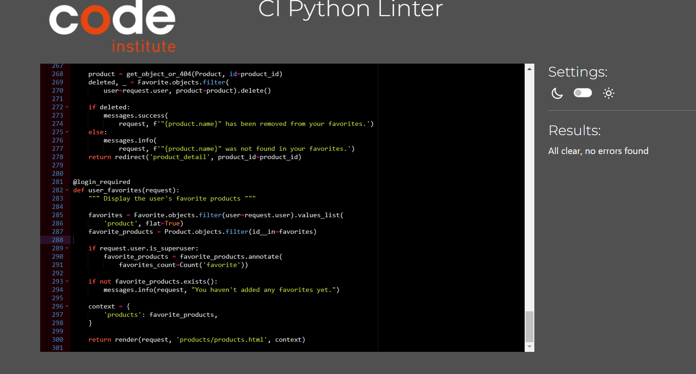
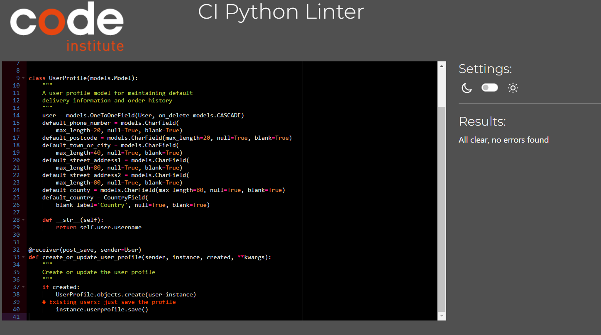
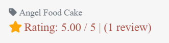
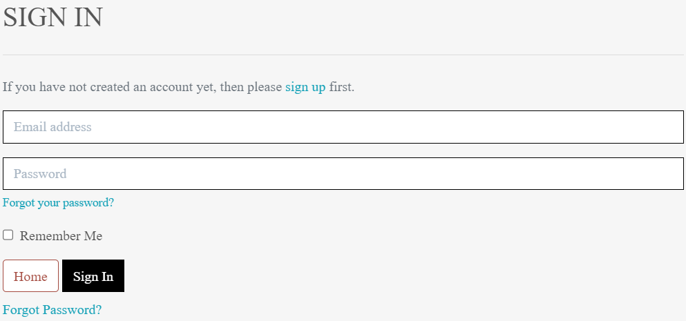

Back to [README.md](/README.md)

- ## Validator Testing

  - ### HTML Validator

    - [HTML results Index page](https://validator.w3.org/nu/?doc=https%3A%2F%2Fboboshop-4896cb751ade.herokuapp.com%2F): no errors
    - [HTML results Products page](https://validator.w3.org/nu/?doc=https%3A%2F%2Fboboshop-4896cb751ade.herokuapp.com%2Fproducts%2F): no errors
    - [HTML results Product detail page](https://validator.w3.org/nu/?doc=https%3A%2F%2Fboboshop-4896cb751ade.herokuapp.com%2Fproducts%2F4%2F): no errors
    - [HTML results Bag page](https://validator.w3.org/nu/?doc=https%3A%2F%2Fboboshop-4896cb751ade.herokuapp.com%2Fbag%2F): no errors
    - [HTML results Checkout](https://validator.w3.org/nu/?doc=https%3A%2F%2Fboboshop-4896cb751ade.herokuapp.com%2Fcheckout%2F): no errors
    - [HTML results Register page](https://validator.w3.org/nu/?doc=https%3A%2F%2Fboboshop-4896cb751ade.herokuapp.com%2Faccounts%2Fsignup%2F): no errors
    - [HTML results Login Page](https://validator.w3.org/nu/?doc=https%3A%2F%2Fboboshop-4896cb751ade.herokuapp.com%2Faccounts%2Flogin%2F): no errors
    - [HTML results Profile page](https://validator.w3.org/nu/?doc=https%3A%2F%2Fboboshop-4896cb751ade.herokuapp.com%2Fprofile%2F): no errors
    - [HTML results Cake stats page](https://validator.w3.org/nu/?doc=https%3A%2F%2Fboboshop-4896cb751ade.herokuapp.com%2Fcake_tracker%2Fstats%2F): no errors
    - [HTML results Order stats page](https://validator.w3.org/nu/?doc=https%3A%2F%2Fboboshop-4896cb751ade.herokuapp.com%2Fcake_tracker%2Fmanage_orders%2F): no errors
    - [HTML results Favourite page](https://validator.w3.org/nu/?doc=https%3A%2F%2Fboboshop-4896cb751ade.herokuapp.com%2Fproducts%2Ffavorites%2F): no errors

  - ### CSS Validator

    -base.css
    

    -checkout.css
    

  - ### JsLint Validator
    - stripe_element.js
      
    - Sort selector
      
    - Country field
      
    - Quntity input
      

- ## Browser Compatibility

  - Testing has been carried out on the following browsers with no issues:
    - Chrome Version 119.0.6045.124 (Official Build) (64-bit)
    - Firefox Version 119.0.1 (64-bit)
    - Edge Version 119.0.2151.58 (Official build) (64-bit)

- ## Python Linter by CodeInstitute
- ### products/views.py
  
- ### products/views.py
  
- ### products/models.py
  
- ### products/forms.py
  
- ### profile/views.py
  
- ### profiles/models.py
  
- ### profiles/forms.py
  
- ### checkout/webhook.py
  
- ### checkout/webhook_handeler.py
  
- ### checkout/views.py
  
- ### checkout/models.py
  
- ### checkout/forms.py
  
- ### cake_tracker/views.py
  
- ### cake_tracker/models.py
  
- ### bag/views.py
  
- ### bag/contexts.py

  

- ## User Story Testing

  | User Story                                                                          | Screenshot                                               |
  | ----------------------------------------------------------------------------------- | -------------------------------------------------------- |
  | As a first time visitor, I want to see the most rated cakes.                        |          |
  | As a first time visitor, I want to purchase without creating an account.            |        |
  | As a first time visitor, I want an easy and secure checkout process.                |  |
  | As a first time visitor, I want an order confirmation.                              |      |
  | As a first time visitor, I want to see clear product descriptions and images        |     |
  | As a returning visitor, I want to be able to register in to the website             |          |
  | As a returning visitor, I want to be able to log in to the website.                 |           |
  | As a returning visitor, I want to be able to favourite cakes.                       |     |
  | As a returning visitor, I want to be able to update my profile.                     |         |
  | As a returning visitor, I want to be able to change my password.                    |  |
  | As a returning visitor, I want to be able to add, edit or delete reviews for cakes. |   |
  | As a administrator, I want to be able to add cakes.                                 |      |
  | As a administrator, I want to be able to edit cakes.                                |     |
  | As a administrator, I want to be able to delete the cakes.                          |      |
  | As a administrator, I want to be able to see the order details.                     |      |
  | As a administrator, I want to be able to track sales.                               |       |

- ## Lighthouse test

| Page            | Device  | Screenshot                                                                | Notes                                 |
| --------------- | ------- | ------------------------------------------------------------------------- | ------------------------------------- |
| Home            | Mobile  |            |                                       |
| Home            | Desktop |           |                                       |
| Favourites      | Mobile  |        |                                       |
| Favourites      | Desktop |       |                                       |
| Products        | Mobile  |         | 68 performance due to image rendering |
| Products        | Desktop |        |                                       |
| Product details | Mobile  |   |                                       |
| Product details | Desktop |  |                                       |
| Cake Sale       | Mobile  |        |                                       |
| Cake Sale       | Desktop |       |                                       |
| Order Stats     | Mobile  |       |                                       |
| Order Stats     | Desktop |      |                                       |
| Profile         | Mobile  |          |                                       |
| Profile         | Desktop |         |                                       |
| Bag             | Mobile  |              |                                       |
| Bag             | Desktop |             |                                       |
| Checkout        | Mobile  |         |                                       |
| Checkout        | Dekstop |        |                                       |

- ## Responsiveness

  The website has been tested on different screen sizes using Google Chrome developer tool simulating devices like Iphone 14 Pro Max, Samsung S20 Ultra and Surface Pro 7 with no issues reported.

  - #### Iphone 14 Pro Max DevTool Screenshoot

    
    

  - #### Iphone SE for small mobile screens
    
    
  - #### Desktop
    
    
    

- ## Manual Testing
  |     Page     |                         User Action                         |                                      Expected Results                                       | Pass/Fail | Comments |
  | :----------: | :---------------------------------------------------------: | :-----------------------------------------------------------------------------------------: | :-------: | :------: |
  |  Home Page   |                     Click on logo name                      |                                    Redirect to home page                                    |   Pass    |
  |              |                  Click on my account icon                   |                                 drop down menu is triggered                                 |   Pass    |
  |              |                      Click on bag icon                      |                                   Redirect to to bag page                                   |   Pass    |
  |              |                    Click on shop button                     |                                Redirect to All products page                                |   Pass    |
  |              |                  Click on cake categories                   |                           Dropdown menu with all cake categories                            |   Pass    |
  |              |                     User not logged in                      |                         Only login and register pages are available                         |   Pass    |
  |              |               Enter search in the search bar                |                           Find products based on search criteria                            |   Pass    |
  |              |                 Click on register menu page                 |                                  Redirect to register page                                  |   Pass    |
  |              |                  User logged in(non admin)                  |        The rest of admin pages are displayed(add products, cake stats, order stats)         |   Pass    |
  |   Register   |  User enter username, email, password and confirm password  |          Validation rule for the username and password and confirm password error           |   Pass    |
  |   Register   |                    Press sign up button                     |                     Confirmation message displayed and account created                      |   Pass    |
  |    Log in    |                  Enter log in credentials                   |              Log in confirmation message displayed and log in pages available               |   Pass    |
  |    Log in    |               Enter wrong log in credentials                |                       Message with wrong username/password displayed                        |   Pass    |
  |  Favourites  |     Open Favourites page (no favourites and logged in)      |              If the user has no favourite "no favourite" message is displayed               |   Pass    |
  |  Favourites  |    Open Favourites page (favourite added and logged in)     |               All the cakes that have been added to favourites are displayed                |   Pass    |
  | All Products |               click on the all products page                |                                All cakes are being displayed                                |   Pass    |
  |   Profile    |          click on the profile page and update info          |              Password has been reset and a confirmation message is displayed.               |   Pass    |
  |  Cake Sales  |        click on cake sales page and filter products         |                    Products based on filter criteria are being displayed                    |   Pass    |
  | Order stats  |       click on Order Stats and eneter filter cirteria       |                     Order are being displayed based on filter criteria                      |   Pass    |
  |  Edit Cake   |                click on the cake edit button                |                         Edit page with the product is being loaded                          |   Pass    |
  | Delete cake  |                     Delete cake button                      |              the modal confirm delete is displayed, delete function is working              |   Pass    |
  |   Log out    |                  click on the log out page                  | User is logged out and the user pages are hidden. Log out comfirmation message is displayed |   Pass    |
  |    Review    |                     click on add review                     |              The modal is displayed with the required fields to add the review              |   Pass    |
  |    Review    |                    click on edit review                     |                        The modal is displayed for editing the review                        |   Pass    |
  |    Review    |                   click on delete review                    |                       The modal is displayed for deleting the review                        |   Pass    |
  |    Toast     |     User action for add to bag, edit, delete, checkout      |                  The toast windows message is being diplayed with success                   |   Pass    |
  |     Bag      | click on a product, select quantity, flavour and add to bag |                          The product is successfully added to bag                           |   Pass    |
  |   Checkout   |              click on checkout(toast and bag)               |                  Checkout page is displayed with perosonal details fields                   |   Pass    |
  |    Stripe    |             Enter card details and confim order             |               payment intent received on stripe account and webhook sent back               |   Pass    |
  |    Email     |                      Order is complete                      |                              Email received with order details                              |   Pass    |
